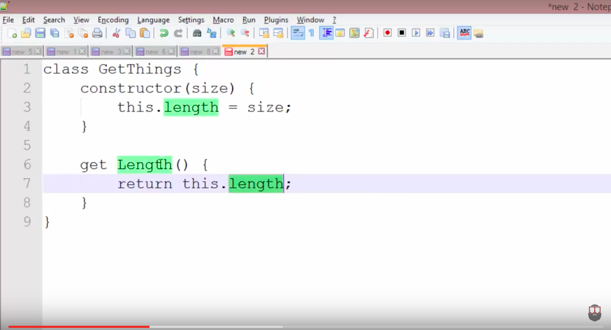
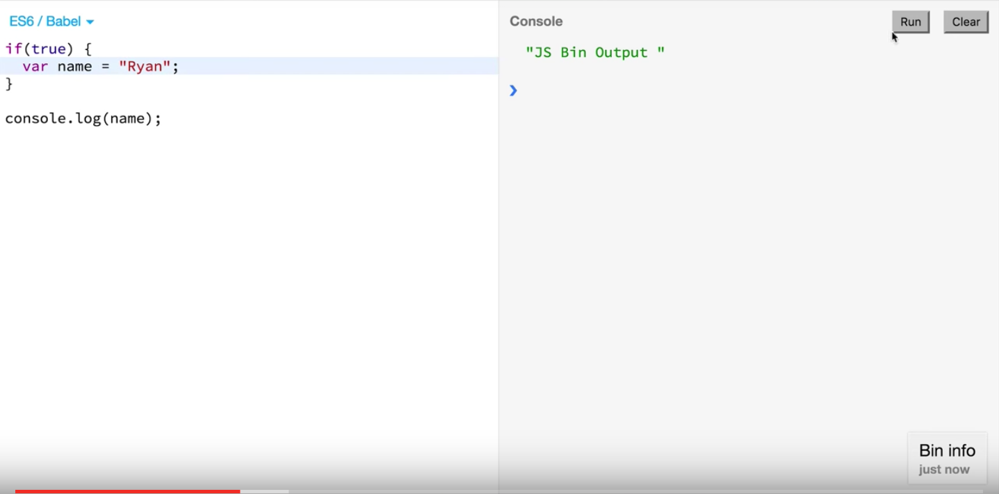

# ES6: Getters and Setters & Template Literals

## Getters & Setters
**Definition**: Getters and setters are used for defining computed properties. A computed property is one that uses a function to get or set an object value.

### Example from ES5
```
var person = {
  name: "Beyonce",
  get name() {
    return this.name;
  },
  set personName(val) {
    this.name = val;
  }
}
```

Then in the console:

```
person.name = "Mrs. Carter"
var bestArtistEver = person.name
console.log(bestArtistEver);
```

### Examples using ES6
```
class Person {
  constructor(name) {
    this._hello = name;
  }
  get personName() {
    return this._hello;
  }
  set personName (newName) {
    this._name = newName;
  }
}
```

Then in the console:

```
let adele = new Person("Adele")
adele.personName
adele.personName = "A-Dawg"
adele.personName
```

### Video
[](https://www.youtube.com/watch?v=nx6DFeNIXlA)

## Template Literals
Template Strings use back-ticks rather than single or double quotes.

They help make the following easier:

* String interpolation
* String concatenation
* Multiline strings
* String substitution

### Example from ES5
Multiline strings in ES5:

```
var teacher = "Andy \n" + "is on a higher level"
```

### Example from ES6
Multiline strings in ES6:

```
var teacher = `Andy
is on a higher level`
```

### Example from ES5
String concatenation:
```
var person = "Andy Kim";
console.log('my name is ' + person + '!');
```
### Example from ES6
Better string concatenation:

```
var person = "Andy Kim";
console.log(`My name is ${person}!`);
```
### Video
[](https://www.youtube.com/watch?v=LTbnmiXWs2k)
